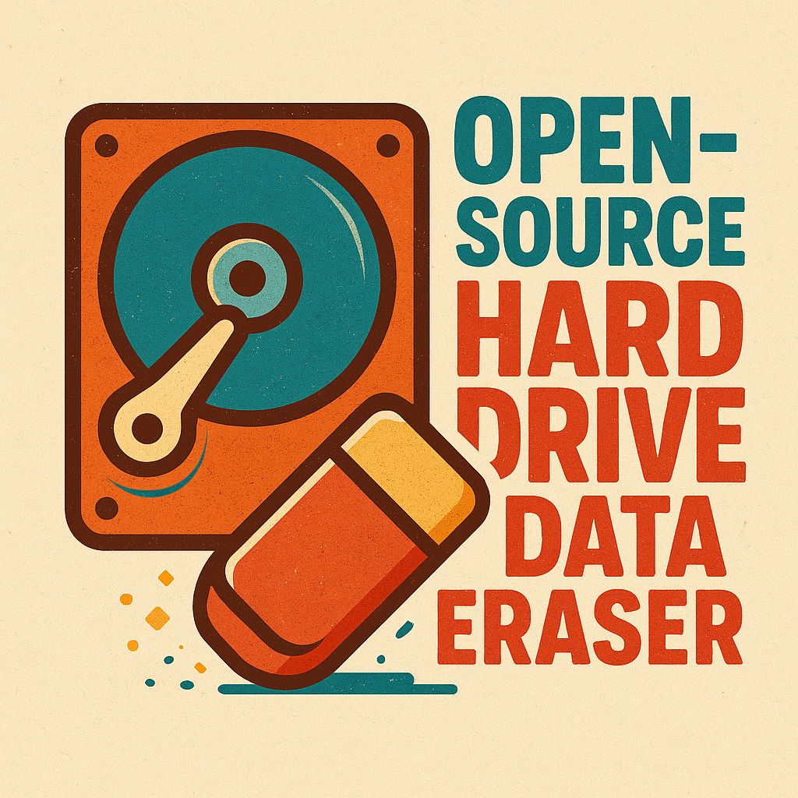
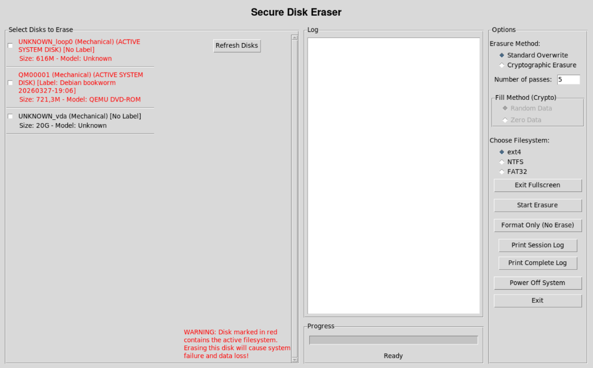
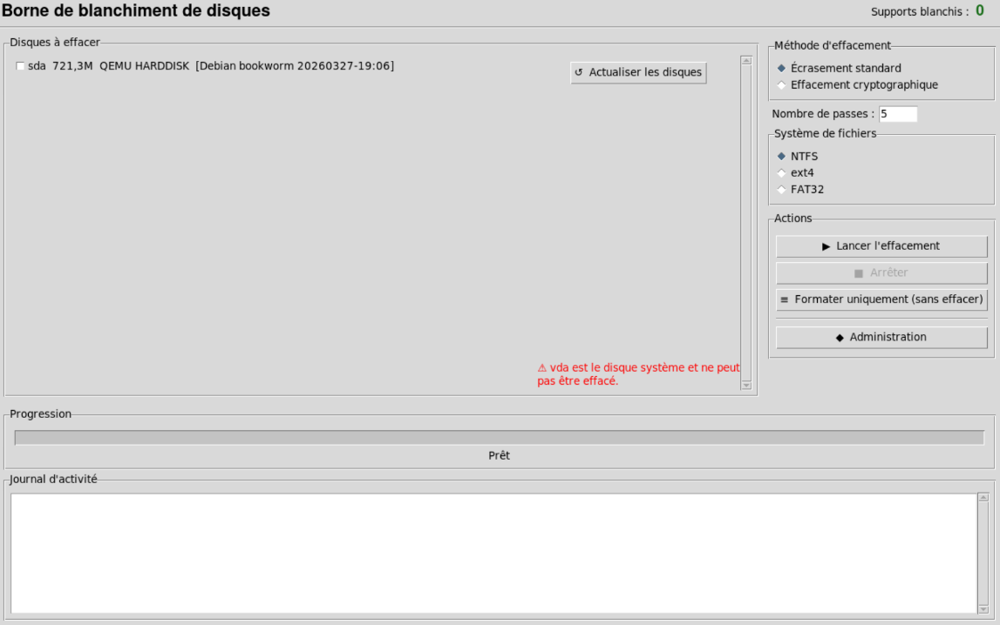

# Disk Eraser - Secure Disk Wiping and Formatting Tool 💽

<div style="display: flex; align-items: center;">
  
  <p>
    <b>Disk Eraser</b> is a tool for securely erasing data from storage devices while providing the option to format with your chosen file system (EXT4, NTFS, or VFAT). It supports parallel disk erasure with configurable overwrite passes for thorough data sanitization.
  </p>
</div>

## Secure Erasure Methods

### For HDDs: Multiple Overwrite Passes
- Recommended for traditional mechanical hard drives
- Uses multiple passes of random data followed by a zero pass
- Prevents data recovery through physical analysis of magnetic residue

### For SSDs: Cryptographic Erasure
- Recommended for solid-state drives and flash storage
- Options include:
  - **Random Data Fill**: Overwrites with cryptographically secure random data
  - **Zero Fill**: Quick erasure by writing zeros to all addressable locations
- Works with ATA Secure Erase for compatible devices

⚠️ **SSD COMPATIBILITY WARNING**

While this tool can detect and work with SSDs, please note:

- **SSD Wear Leveling**: Makes traditional overwrite methods less effective
- **Over-provisioning**: Hidden reserved space may retain data
- **Device Lifespan**: Multiple passes can reduce SSD longevity
 
For SSDs, cryptographic erasure methods are recommended over multiple overwrite passes.

⚠️ **USB FLASH DRIVE PERFORMANCE WARNING**
 
The Linux kernel often incorrectly marks USB flash drives as rotational devices, which can significantly impact performance during erasure operations. This is a known kernel issue affecting USB storage devices.
 
**To fix this issue when NOT using the custom ISO**, create the following udev rule:

This rule is available on stackexchange : [Solution from stackexchange](https://unix.stackexchange.com/questions/439109/set-usb-flash-drive-as-non-rotational-drive)

1. Create the file `/etc/udev/rules.d/usb-flash.rules` with root privileges:
```bash
sudo nano /etc/udev/rules.d/usb-flash.rules
```

2. Add the following content:

```bash
# Try to catch USB flash drives and set them as non-rotational
# c.f. https://mpdesouza.com/blog/kernel-adventures-are-usb-sticks-rotational-devices/

# Device is already marked as non-rotational, skip over it
ATTR{queue/rotational}=="0", GOTO="skip"

# Device has some sort of queue support, likely to be an HDD actually
ATTRS{queue_type}!="none", GOTO="skip"

# Flip the rotational bit on this removable device and give audible signs of having caught a match
ATTR{removable}=="1", SUBSYSTEM=="block", SUBSYSTEMS=="usb", ACTION=="add", ATTR{queue/rotational}="0"
ATTR{removable}=="1", SUBSYSTEM=="block", SUBSYSTEMS=="usb", ACTION=="add", RUN+="/bin/beep -f 70 -r 2"

LABEL="skip"
```

3. Reload udev rules and restart the udev service:
```bash
sudo udevadm control --reload-rules
sudo systemctl restart systemd-udevd
```
 
4. Reconnect your USB flash drives to apply the new rules.

**Note**: The custom ISO images already include these optimization rules.

---

## Features ✨

- **Dual Interface**: CLI and GUI modes for flexibility
- **Smart Device Detection**: Automatically identifies electronic vs mechanical devices
- **LVM Support**: Handles LVM disk management
- **Secure Erasure Methods**:
  - Multiple overwrite passes for HDDs
  - Cryptographic erasure for SSDs (random or zero fill)
- **Safety Features**: Detects active system disks and requires confirmation
- **Parallel Processing**: Erases multiple disks simultaneously
- **Post-Erasure Setup**: Automatic partitioning and formatting
- **Flexible Formats**: Supports NTFS, EXT4, and VFAT file systems
- **Format-only capacity** : Solely format disk in selected format without data erasure
- **Multiple Deployment Options**: Run as Python code, Linux command, or bootable ISO
- **Improved disks listing format in GUI mode**: Prompts useful data about disks detected
- **Comprehensive Logging System**:
  - **Real-time Progress Tracking**: Monitor operation status with detailed step logging
  - **Error Handling & Recovery**: Advanced error detection
  - **Session Logs**: Track individual operation sessions with timestamps
  - **Complete Operation History**: Maintain full audit trail of all disk operations
  - **PDF Export Capability**: Export logs to PDF format for printing or archiving

---


## Live vs Installer mode
Pre-built 64 bits ISO comes with two boot modes integrated.

### Live mode
Live mode is advised when virtualizing a machine by directly booting on the target system via a bootable USB key containing the ISO. The virtualization process runs entirely from the live environment without any installation required on the host machine.

Users have access to all features, including the ability to export logs to an external storage device before shutting down the session.

<div style="display: flex; align-items: center;">
  
</div>

### Installer mode
Installer mode is designed for use as a **fixed sanitizer workstation**, where physical drives removed from their original machines, or external devices, are connected directly to the station for sanitization. This mode is intended for a permanent, dedicated setup rather than on-site interventions.

All features are available to the user, with the exception of the following operations which are **restricted to administrator access (password protected)**:

| Protected action | Reason |
|---|---|
| Log export from the station | Prevent unauthorized data extraction |
| Log purge | Preserve audit trail integrity |
| System restart & shutdown | Ensure workstation availability |
| Exiting kiosk mode | Maintain controlled environment |

<div style="display: flex; align-items: center;">
  
</div>

### Quick comparison

| | Live mode | Installer mode |
|---|---|---|
| **Use case** | On-site, boot on target machine | Fixed workstation, attach external drives |
| **Installation required** | No | Yes |
| **Log export** | ✅ User | 🔒 Admin only |
| **Log purge** | ✅ User | 🔒 Admin only |
| **Restart / Shutdown** | ✅ User | 🔒 Admin only |
| **Exit kiosk mode** | ✅ User | 🔒 Admin only |
| **Erasure external drives** | ✅ User | ✅ User |
| **Format external drives** | ✅ User | ✅ User |

## Prerequisites 📋

- **Root privileges** (required for disk access)
- **Python 3** with **Tkinter** (for GUI mode)
- **Basic disk management knowledge** - this tool **permanently erases data** ⚠️

---

## Installation and Usage 🚀

### Using Python Code 🐍
⚠️ **If you want to install system with admninistrative pannel, please use *code_installer* folder instead of *code* folder**

```bash
git clone https://github.com/Bolo101/diskEraser.git
cd diskEraser/code/python
sudo python3 main.py         # GUI mode (default)
sudo python3 main.py --cli   # Command-line mode
```

### Install as Linux Command 💻

```bash
sudo mkdir -p /usr/local/bin/diskeraser
sudo cp diskEraser/code/python/*.py /usr/local/bin/diskeraser
sudo chmod +x /usr/local/bin/diskeraser/main.py
sudo ln -s /usr/local/bin/diskeraser/main.py /usr/local/bin/diskeraser

# Then run:
sudo diskeraser           # GUI mode
sudo diskeraser --cli     # CLI mode
```

### Using Bootable ISO 💿

1. **Create or download ISO**:

    - **Create iso**:

    Select ISO version you need, 32 bits or 64 bits, XFCE (lighter) or KDE. 

    ```bash
    cd iso/
    make
    make 32      # 32 bits environment (no installer mode)
    make all-iso # All 4 ISOs generated
    make clean   # Clean build files
    make help    # Display helper message
    ```
    - **Pre-built ISO**

    Download pre-built: [Disk Eraser ISO v6.0](https://archive.org/details/diskEraser-v6.0)

      ```txt
      - diskEraser-v6.0-64bits.iso : f4e1280807a3051471a93a523640aff3e7a74ccb65cd8160ba3966cd31240653
      - diskEraser-v6.0-32bits.iso : 6772e31d597771a351a0341dfd69b247965f613266f1cf261735cf4290fd9ffc
      ```

2. **Flash to USB**:
   ```bash
   sudo dd if=secure_disk_eraser.iso of=/dev/sdX bs=4M status=progress
   ```

3. **Boot from USB** and follow on-screen instructions

---

## Command Line Options ⌨️

```bash
# Format options
-f ext4|ntfs|vfat, --filesystem ext4|ntfs|vfat

# Erase pass count
-p NUMBER, --passes NUMBER

# Interface mode
--cli           # Use command-line interface

# Examples:
python3 main.py -f ext4 -p 3      # GUI, EXT4, 3 passes
python3 main.py --cli -f ntfs     # CLI, NTFS, default passes
```

---
## Project Structure 🏗

```
project/
├── README.md               # Documentation
├── code/                   # Python scripts
│   ├── disk_erase.py       # Erasure module
│   ├── disk_format.py      # Formatting module
│   ├── disk_operations.py  # Disk operations
│   ├── disk_partition.py   # Partitioning module
│   ├── gui_interface.py    # GUI interface
│   ├── cli_interface.py    # CLI interface
│   ├── log_handler.py      # Logging functionality
│   ├── main.py             # Main program logic
│   └── utils.py            # Utility functions
├── iso/                    # ISO creation resources
│   ├── forgeIsoPy.sh       # ISO generator
│   └── makefile            # Build automation
├── setup.sh                # Dependency installer
└── LICENSE                 # CC 4.0 license
```

---

## Safety Notes ⚠️

- **Data Loss**: This tool **permanently erases** data. Back up important information first.
- **Root Access**: Run with appropriate privileges (root/sudo).
- **Storage Types**: Different erasure methods are optimized for different storage technologies:
  - For HDDs: Multiple overwrite passes
  - For SSDs: Cryptographic erasure (random or zero fill)
- **System Protection**: The tool detects and warns about active system disks.
- **Audit Trail**: Maintain log files for compliance and troubleshooting purposes.

---

## License ⚖️

This project is licensed under the [Creative Commons Attribution-NonCommercial-ShareAlike 4.0 International License](https://creativecommons.org/licenses/by-nc-sa/4.0/).


You are free to:
- **Share**: Copy and redistribute the material
- **Adapt**: Remix, transform, and build upon the material

Under the following terms:
- **Attribution**: Provide appropriate credit
- **NonCommercial**: Not for commercial use
- **ShareAlike**: Distribute modifications under the same license